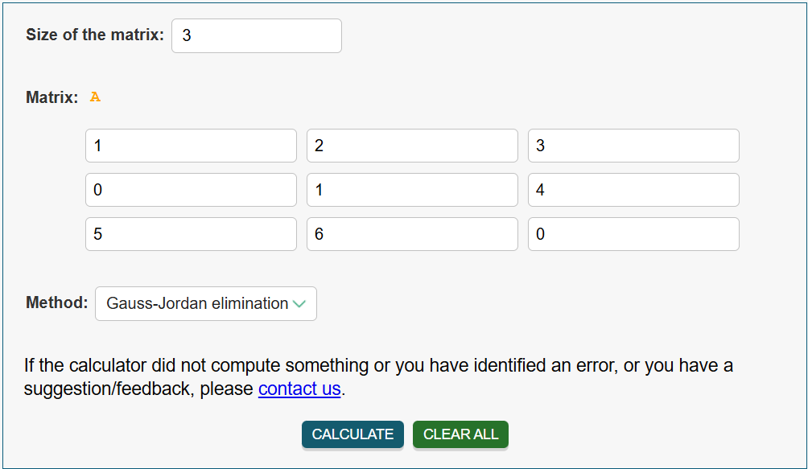
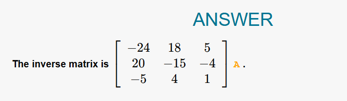
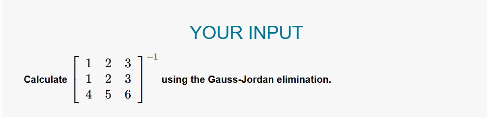

# Matrix Inverter - Test Cases

This document contains various test cases to verify the functionality of the Matrix Inverse Calculator. Each test case includes screenshots from reference calculators for comparison and validation.

## Table of Contents
- [How to Use This Document](#how-to-use-this-document)
- [Basic Test Cases](#basic-test-cases)
<!-- - [Edge Cases](#edge-cases) -->
- [Singular Matrices (Non-Invertible)](#singular-matrices-non-invertible)
<!-- - [Special Matrices](#special-matrices)
- [Large Matrices](#large-matrices) -->

---

## How to Use This Document

For each test case:
1. **Input Matrix** - Copy these values into the calculator
2. **Reference Screenshot** - Shows expected output from verified calculator
3. **Expected Result** - Text description of the correct answer
4. **Verification** - How to confirm the result is correct

---

## Basic Test Cases

### Test Case 1: Simple 2×2 Matrix

**Input Matrix:**
```
[ 2   1 ]
[ 1   3 ]
```

**Reference Calculator Screenshot:**


**Expected Inverse:**
```
[  3/5  -1/5 ]
[ -1/5   2/5 ]
```
or in decimal form:
```
[  0.6  -0.2 ]
[ -0.2   0.4 ]
```

**Description:** Basic invertible 2×2 matrix with positive integers. Good starting test case.

**Verification:** A × A⁻¹ should equal the identity matrix.

---

### Test Case 2: 2×2 Identity Matrix

**Input Matrix:**
```
[ 1   0 ]
[ 0   1 ]
```

**Reference Calculator Screenshot:**


**Expected Inverse:**
```
[ 1   0 ]
[ 0   1 ]
```

**Description:** Identity matrix should return itself as the inverse. Tests basic edge case.

---

### Test Case 3: 3×3 Matrix with Fractions

**Input Matrix:**
```
[ 1   2   3 ]
[ 0   1   4 ]
[ 5   6   0 ]
```

**Reference Calculator Screenshot:**



**Expected Inverse:**
```
[ -24   18    5 ]
[  20  -15   -4 ]
[  -5    4    1 ]
```

**Description:** 3×3 matrix that produces integer results. Tests Gauss-Jordan elimination on larger matrix.

---

## Singular Matrices (Non-Invertible)

### Test Case 4: Zero Determinant - Duplicate Rows

**Input Matrix:**
```
[ 1   2   3 ]
[ 1   2   3 ]
[ 4   5   6 ]
```

**Reference Calculator Screenshot:**



**Expected Result:** Error message - "The matrix is singular (non-invertible)" or "Determinant is zero"

**Description:** Matrix with duplicate rows has determinant = 0. Should be caught during elimination.

<!-- 
---

### Test Case 10: Zero Determinant - Proportional Rows

**Input Matrix:**
```
[ 2   4 ]
[ 1   2 ]
```

**Reference Calculator Screenshot:**


**Expected Result:** Error - "The matrix is singular (non-invertible)"

**Description:** Second row is half of the first row. Linear dependence test.

---

### Test Case 11: Zero Row

**Input Matrix:**
```
[ 1   2   3 ]
[ 0   0   0 ]
[ 4   5   6 ]
```

**Reference Calculator Screenshot:**


**Expected Result:** Error - "The matrix is singular (non-invertible)"

**Description:** Matrix with a zero row cannot be inverted.


---

### Test Case 14: Symmetric Matrix

**Input Matrix:**
```
[ 4   1   2 ]
[ 1   3   1 ]
[ 2   1   5 ]
```

**Reference Calculator Screenshot:**


**Expected Result:** Should produce a symmetric inverse.

**Description:** Symmetric positive definite matrix. Inverse should also be symmetric.

---

### Test Case 15: Rotation Matrix

**Input Matrix:**
```
[ 0.6  -0.8 ]
[ 0.8   0.6 ]
```

**Reference Calculator Screenshot:**


**Expected Inverse:**
```
[ 0.6   0.8 ]
[-0.8   0.6 ]
```

**Description:** Rotation matrix (30°) - transpose should equal inverse.

---

## Large Matrices

### Test Case 16: 5×5 Matrix

**Input Matrix:**
```
[ 5   7   2   1   3 ]
[ 1   4   6   8   2 ]
[ 3   2   5   4   9 ]
[ 7   1   8   3   5 ]
[ 2   6   4   7   1 ]
```

**Reference Calculator Screenshot:**


**Expected Result:** Should produce valid inverse (verify A × A⁻¹ = I)

**Description:** Tests performance and accuracy with larger matrix. -->

---


**Example:**
```
testcases/
├── tc1-input.png
├── tc1-output.png
├── tc2-input.png
├── tc2-output.png
└── ...
```

---

## How to Add New Test Cases

1. **Find a reference calculator** (e.g., Symbolab, WolframAlpha, Matrix Calculator)
2. **Input your test matrix** and calculate the inverse
3. **Take screenshots** of both input and output
4. **Save screenshots** using the naming convention above
5. **Add test case** to this document with:
   - Input matrix (formatted clearly)
   - Screenshot references
   - Expected output
   - Description of what it tests

---

## Recommended Reference Calculators

- [eMathHelp Math Solver](https://www.emathhelp.net/calculators/linear-algebra/inverse-of-matrix-calculator) -- __Currently Used__
- [Symbolab Matrix Calculator](https://www.symbolab.com/solver/matrix-calculator)
- [WolframAlpha](https://www.wolframalpha.com/)
- [Matrix Calculator](https://matrixcalc.org/)
- [Desmos Matrix Calculator](https://www.desmos.com/matrix)

---

## Verification Method

To verify any inverse matrix A⁻¹:
1. Calculate the product: A × A⁻¹
2. The result should be the Identity matrix I
3. All diagonal elements should be 1 (or ≈ 0.9999)
4. All off-diagonal elements should be 0 (or ≈ 0.0001)

---

**Last Updated:** January 2026